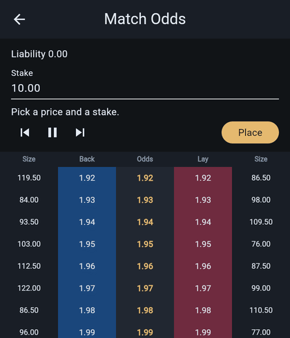

# tickrail

Live exchange prices painted on a Flutter render rail.

A market that ticks twenty times a second should not walk the element tree.
tickrail reserves layout, holds slot geometry, and writes the tape onto a
RenderBox. Page chrome stays regular widgets. The hot path only marks paint.

Betfair-accurate tick steps, integer-cent money, orders that match against
the size on the tape, and one-tap hedging, all on a replayable tape so the
ladder can be tested without a clock.

## Desk



After `flutter run` you get a market list. Add, rename or delete a market,
then open it. The ladder is one paint: back in blue, lay in pink, odds in
brass. Tap a price, set a stake in pounds, and place, amend or cancel the
order. Step or play walks a fixed tape, which is the same sequence this
capture and the tests drive.

The capture above is the web build: a back at 1.98 is placed, matches on the
next frame, and is then hedged with a lay at 1.92 that locks in 0.31 either
way.

## Matching and hedging

Each tape frame carries the size available at every price. A resting back
fills against the back size at its price, a lay against the lay size, and an
order larger than the size fills over several frames. On the ladder a brass
bar under a cell is stake still waiting, a green bar above it is stake that
has matched.

Matched bets roll up into a position: what the market pays if the selection
wins and if it loses. Selecting any price offers the hedge for that price,
the opposite bet that makes both outcomes equal, and shows the amount it
locks in. The stake is rounded to the cent, so the two outcomes can differ
by the rounding at that price and never by more.

Liability is the unmatched risk of resting orders plus the worst matched
outcome. A fully hedged market with nothing resting carries none.

Cancelling a part-matched order removes only the unmatched remainder, and a
stake cannot be amended below what has already matched.

| Layer | Where | Tests |
| --- | --- | --- |
| Hedge arithmetic | `lib/domain/position.dart` | `test/position_test.dart` |
| Matching, liability | `lib/data/desk_store.dart` | `test/matching_test.dart` |
| Matched marks on the rail | `lib/paint/ladder_rail.dart` | `test/ladder_rail_test.dart` |
| Desk flow | `lib/ui/ladder_page.dart` | `test/ladder_page_test.dart` |

## Run

```
flutter pub get
flutter run
flutter test
```

Web: `flutter run -d chrome` or `flutter build web`.

The device walk-through lives in `integration_test/desk_flow_test.dart`.

## License

MIT
